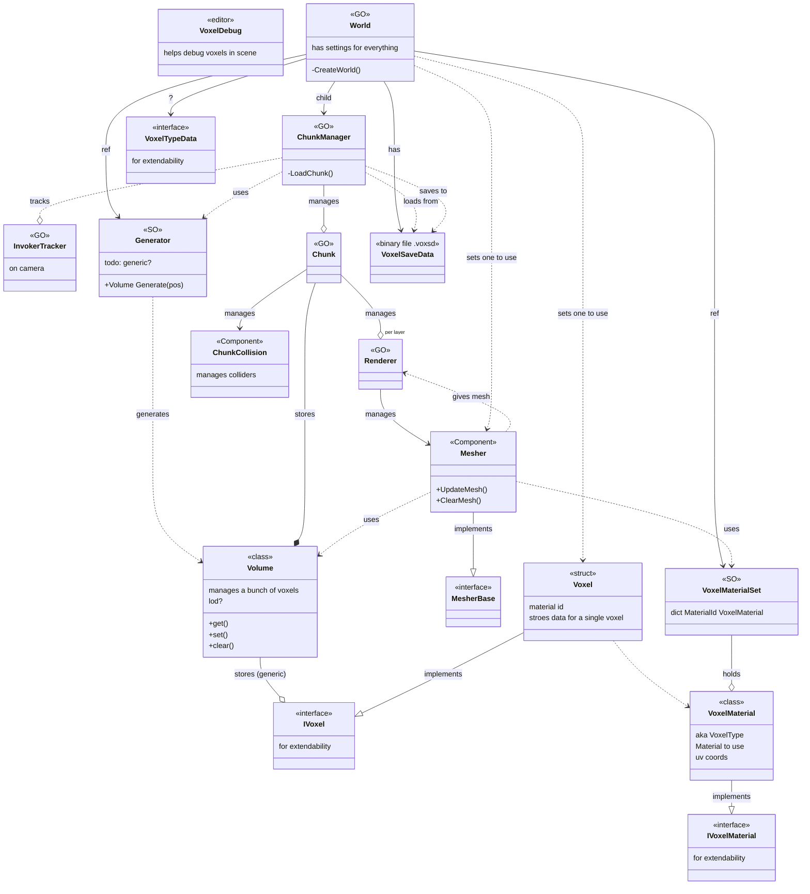

## Voxel System Class Diagram

```mermaid
classDiagram
direction TB
%% diagram for general voxel world related classes

class VoxelDebug {
  <<editor>>
  helps debug voxels in scene
}

%% world has lots of settings for everything
%% there can be multiple worlds in a scene
class World {
  <<GO>>
  -CreateWorld()
  has settings for everything
}
class ChunkManager{
  <<GO>>
  -LoadChunk()
}
class InvokerTracker{
  <<GO>>
  on camera
}
class Chunk{
  <<GO>>
}
class Volume{
  <<class>>
  manages a bunch of voxels
  lod?
  +get()
  +set()
  +clear()
}
class Renderer{
  <<GO>>
}
class MesherBase{
  <<interface>>
}
class Mesher{
  <<Component>>
  +UpdateMesh()
  +ClearMesh()
}
class ChunkCollision{
  <<Component>>
  manages colliders
}
class Generator{
  <<SO>>
  todo: generic?
  +Volume Generate(pos)
}
class IVoxel{
  <<interface>>
  for extendability
}
class Voxel{
  <<struct>>
  material id
  stroes data for a single voxel
}
class VoxelSaveData {
  <<binary file .voxsd>>
}
class VoxelTypeData {
  <<interface>>
  for extendability
}
class VoxelMaterialSet{
  <<SO>>
  dict MaterialId VoxelMaterial
}
class IVoxelMaterial{
  <<interface>>
  for extendability
}
class VoxelMaterial{
  <<class>>
  aka VoxelType
  Material to use
  uv coords
}

World --> VoxelSaveData : has
World --> Generator : ref
World --> ChunkManager : child
World --> VoxelMaterialSet : ref
World --> VoxelTypeData : ?

%% add some indirection with save vs generate?
ChunkManager ..> Generator  : uses
ChunkManager ..> VoxelSaveData : loads from
ChunkManager ..> VoxelSaveData : saves to
ChunkManager --o Chunk : manages
ChunkManager ..o InvokerTracker: tracks

Generator ..> Volume : generates

Chunk --> ChunkCollision : manages
Chunk --o "per layer" Renderer : manages
Chunk --* Volume : stores

Mesher --|> MesherBase : implements
Mesher ..> Volume : uses
Mesher ..> VoxelMaterialSet : uses
%% should there be one mesher per renderer?
%% or mesher is on the chunk and gives multiple meshes for all renderers? dont want to recheck every voxel for each layer when meshing, instead handle multiple meshes in one?
%% Chunk --> Mesher : has
Renderer --> Mesher : manages
Mesher ..> Renderer : gives mesh
World ..> Mesher : sets one to use
World ..> Voxel : sets one to use
Voxel ..> VoxelMaterial

VoxelMaterialSet --o VoxelMaterial : holds
VoxelMaterial --|> IVoxelMaterial : implements

Volume --o IVoxel : stores (generic)
Voxel --|> IVoxel : implements


%% click ChunkManager href "ChunkManager.cs" "tooltip"
```
