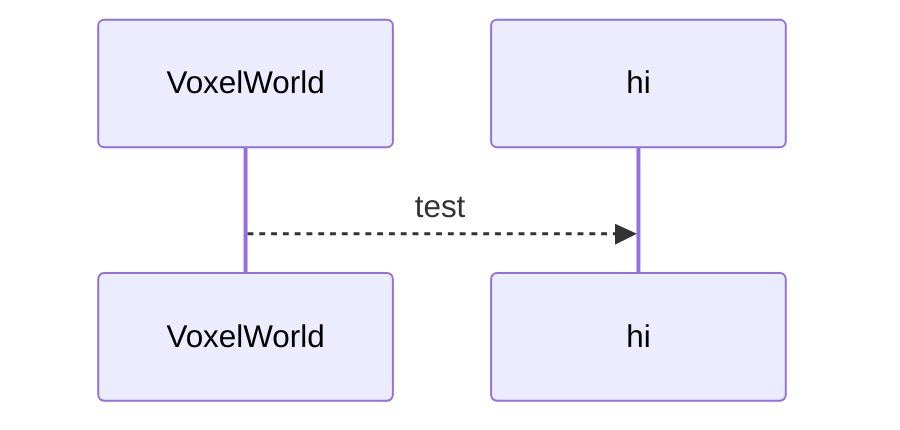

# Voxel System

### goal
create a system that works and use it for a project, expanding on it
repeat until fully featured?
later: put on asset store?

wants
easy to setup and use
extendable
dynamic LOD, GPU accelerated, multithreaded
editor tools
runtime modification

small voxel renderer (for single chunk objects)
voxel world (for up to infinite terrain)
realtime voxelization? maybe

runtime modifiable and destructable
custom data on any voxel?
rigidbody physics?

## todo

### todo next
- mesher create mesh using octtree
- world chunk management better
- voxel direction?
- save voxels to file
- load voxels from file

- use UniTask? https://github.com/Cysharp/UniTask.git?path=src/UniTask/Assets/Plugins/UniTask

### todo general
- [ ] publish online
  - [ ] remove dependency on Kutil
  - [ ] paid version?
  - [ ] lisence
  - [ ] sample scenes
  - [ ] tests
  - [ ] api docs
- [ ] Voxel World
  - [ ] Chunk management
    - [ ] auto load around cameras?
  - [ ] LODs
    - [ ] Octtree
    - [ ] dynamic?
  - [ ] show in editor
  - [ ] edit tools
  - [ ] Generators
    - [ ] simple flat
    - [ ] node graph?
    - [ ] scripting api?
- [ ] Voxel Model
  - [ ] like world but no chunks
- [ ] Voxel Data
  - [ ] stores just an int? uint16? float?
  - [ ] Materials
    - [ ] multiple options
      - [ ] seperate material per face (but batch when not seperate)
      - [ ] uv position offset
      - [ ] world uv offset (so a texture can spread across multiple voxels)
      - [ ] tint?
      - [ ] seperate layer
- [ ] mesh generation
  - [ ] options
    - [ ] simple cubes
    - [ ] greedy cubes
    - [ ] quick greedy cubes
    - [ ] marching cubes
    - [ ] Transvoxel Algorithm
    - [ ] something with sharp edges?
  - [ ] non perfect cubes?
- [ ] collision
  - [ ] cube or mesh?
- [ ] save and load
  - [ ] voxel file format
  - [ ] compression vs load speed
  - [ ] import from multiple sources
- [ ] testing
  - [ ] performance test
    - [ ] many voxels
    - [ ] lots of changes per frame 
  - [ ] smoke test all features
- [ ] extra stuff
  - [ ] navmesh
  - [ ] voxel lighting?
  - [ ] voxel ambient occlusion
  - [ ] non destructive editing - virtualize existing meshes?
    - [ ] add/remove, smoothness
  - [ ] water and other liquids
  - [ ] foliage?
  - [ ] more importers
  - [ ] gpu acceleration?
  - [ ] timing profiling
  - [ ] physics? seperate voxels come apart and turn into rb
  - [ ] multiplayer

## resources

voxels
https://0fps.net/category/programming/voxels/
https://web.archive.org/web/20170726225835/http://alexstv.com/index.php/category/voxel-tutorial
https://sites.google.com/site/letsmakeavoxelengine/home
other voxel systems
 Voxel Plugin
https://github.com/BlakkM9/VengineX/tree/master/VengineX/Graphics
LOD
https://www.reddit.com/r/VoxelGameDev/comments/u1uqth/my_first_attempt_to_create_an_octree_based_lod/
SVO
https://eisenwave.github.io/voxel-compression-docs/svo/svo.html
https://research.nvidia.com/sites/default/files/pubs/2010-02_Efficient-Sparse-Voxel/laine2010tr1_paper.pdf
proc gen
https://www.youtube.com/playlist?list=PLcRSafycjWFesScBq3JgHMNd9Tidvk9hE
https://www.youtube.com/watch?v=NIiREmJnAX0&list=PLcRSafycjWFceHTT-m5wU51oVlJySCJbr&index=11
https://link.springer.com/article/10.1007/s00371-020-01920-7
marching cubes
https://github.com/Javier-Garzo/Marching-cubes-on-Unity-3D
https://github.com/Eldemarkki/Marching-Cubes-Terrain/
misc
https://forum.unity.com/threads/tutorial-procedural-meshes-and-voxel-terrain-c.198651/
old
https://blog.tedd.no/2018/12/22/building-a-voxel-engine-part-1/
https://unitycoder.com/blog/2012/10/18/voxel-resources-engines-for-unity/

## Data Storage

voxel storage
| type | array   | octree      | rle         | boxmodel |
| ---- | -----   | ------      | -----       | -------- |
| get  | 1       | log8n3 | n3     | n/a        |
| set  | 1       | log8n3 | n/a         | n/a      |
| mem  | n3 | 1< n2  | 1< n3  | 1\< n1 ? |
| save?| y       | no  ?       | y           | y          |
<!-- n^2^  x2 -->

boxmodel theoretically stores entire volumes
conversions usually based on voxel complexity - lots of multiple different types near each other  

sparse octree only encodes surfaces, technically.  
they cannot be stored sparsely though? eh it should be possible  
something like  
- |-v  
- |-c  
  - |-v 
  - |-v  
  - |-v  
  - |-v   
- |-v  
- |-v  

maybe hash table with vertical rles for changed voxels, and compressed table for unchanged voxels

## logic

## other voxel system notes

### Voxel Plugin notes
- voxel plugin unity
- port to unity
- have all major features
- and some others

Voxel World
- Preview
	- toggle
	- clear world/values/mats
	- set dirty values/mats
	- scale data
	- auto refresh
- Save
	- set save object
	- load from save obj button
	- save/load to file
- General
	- voxel size
	- generator select
	- placable item manager select? (data for generator to use, I think)
	- create automatically option
	- undo redo support
	- custom rebasing 
	- debug 
- World size
	- world width in voxels, render octtree depth(10),custom world bounds 
- Rendering
	- render type: marching cubes, cubic, or suface nets
	- enable(or just for collisions), other settings 
- Materials
	- mode - rgb(color), single index(materials), multiindex(smoothed materials?)
	- config
	- materials
		- voxel material collection
	- UVs
		- global or per voxel or chunk or pack world up
		- scale
	- LOD, Normals, Hardness
- Spawners (spawn prefabs on terrain)
	- set spawner
- Physics
	- simulate, gravity, other rb settings?
- Collisions
	- enable, complex or simple or both, layer
- Navmesh
	- enable, compute, max lod
- LOD settings
	- max lod
	- min lod? certain applications
	- constant option, min update delay, invoker distance threshold
- Performance settings
	- create global pool and threads
	- octtree depth
	- mesh update budget per tick (1000 ms)
	- priorities
		- chunk meshing - collision, visible, vis and col
		- collision cooking, folliage build, instanced mesh culling tree, async edit, mesh merge, render octtree(determines lod)
- Multiplayer
	- enable, interface, sync rate
- Bake (to static meshes)

